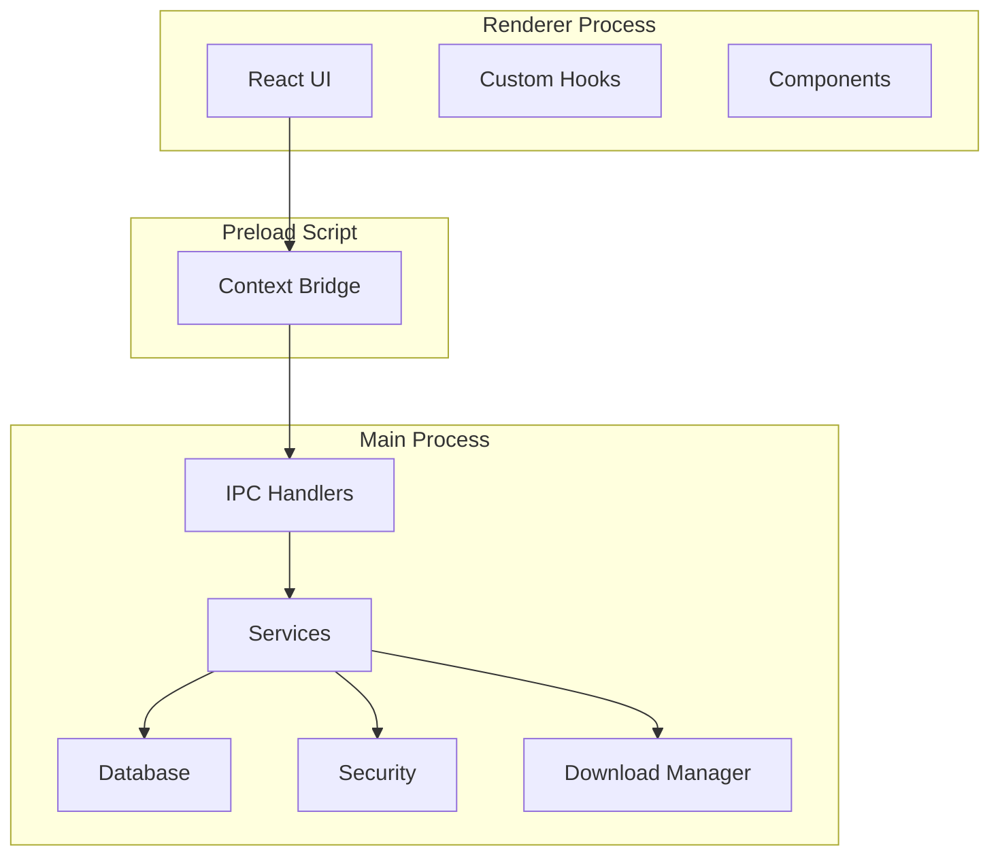
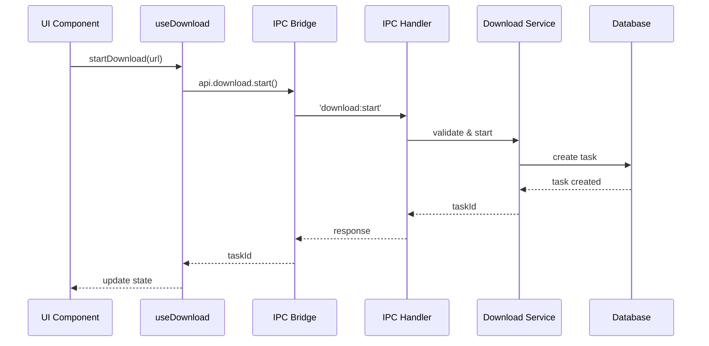
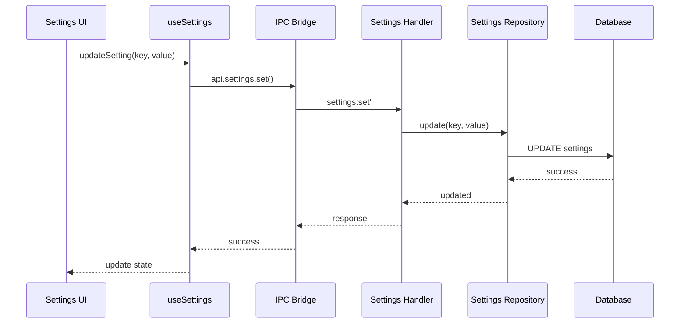

# Module Architecture

This document describes the modular architecture of the Video Downloader application, including module interactions, dependencies, and data flow.

## Architecture Overview



## Core Modules

### 1. Main Process Modules

#### IPC Module (`src/main/ipc/`)

**Purpose**: Handles all inter-process communication between main and renderer processes.

**Key Components**:
- `handlers/` - Individual handler implementations
- `utils/` - Error handling, performance utilities
- `types.ts` - IPC-specific type definitions

**Dependencies**:
- Database repositories
- Security validators
- Service layer

**Interactions**:
```typescript
// Handler registration
ipcMain.handle('download:start', downloadHandler);

// Handler implementation
async function downloadHandler(event, spec) {
  const validated = validate(spec);
  const result = await downloadService.start(validated);
  return result;
}
```

#### Database Module (`src/main/db/`)

**Purpose**: Manages all database operations using SQLite and Drizzle ORM.

**Key Components**:
- `client.ts` - Database connection
- `schema/` - Table definitions
- `repositories/` - Data access layer
- `migrations/` - Schema migrations

**Dependencies**:
- SQLite driver (better-sqlite3)
- Drizzle ORM

**Interactions**:
```typescript
// Repository pattern
class TaskRepository {
  private db = getDatabase();
  
  async create(data: TaskInput): Promise<Task> {
    return await this.db.insert(tasks).values(data).returning();
  }
}
```

#### Security Module (`src/main/security/`)

**Purpose**: Provides security validations and protections.

**Key Components**:
- `path-validator.ts` - Path traversal prevention
- `network-security.ts` - SSRF protection
- `drm-detector.ts` - DRM content detection
- `csp.ts` - Content Security Policy
- `legal-consent.ts` - Terms acceptance

**Dependencies**:
- Node.js crypto
- Path utilities

**Interactions**:
```typescript
// Validation chain
function validateDownload(spec: DownloadSpec) {
  if (!PathValidator.isPathSafe(spec.outputPath)) {
    throw new SecurityError('Invalid path');
  }
  if (!NetworkSecurity.isSafeUrl(spec.url)) {
    throw new SecurityError('Unsafe URL');
  }
  return true;
}
```

#### Download Module (`src/main/services/download/`)

**Purpose**: Manages video download operations.

**Key Components**:
- `DownloadManager` - Orchestrates downloads
- `SegmentDownloader` - Handles multi-part downloads
- `StreamParser` - Parses HLS/DASH manifests
- `FFmpegProcessor` - Video processing

**Dependencies**:
- FFmpeg
- HTTP clients
- File system

**State Management**:
```typescript
class DownloadManager {
  private downloads = new Map<string, DownloadTask>();
  
  async start(spec: DownloadSpec): Promise<string> {
    const task = new DownloadTask(spec);
    this.downloads.set(task.id, task);
    await task.start();
    return task.id;
  }
}
```

### 2. Renderer Process Modules

#### Components Module (`src/renderer/components/`)

**Purpose**: React UI components.

**Key Components**:
- Layout components
- Form components
- Display components
- Utility components

**Dependencies**:
- React
- Material-UI (or chosen UI library)

**State Management**:
```typescript
// Component with hooks
export default function DownloadList() {
  const { tasks, loading } = useDownloadTasks();
  
  return (
    <List>
      {tasks.map(task => (
        <TaskItem key={task.id} task={task} />
      ))}
    </List>
  );
}
```

#### Hooks Module (`src/renderer/hooks/`)

**Purpose**: Custom React hooks for business logic.

**Key Hooks**:
- `useDownloadTasks` - Download management
- `useSettings` - Settings management
- `useTheme` - Theme switching
- `useIPC` - IPC communication wrapper

**Dependencies**:
- React hooks
- Window API (from preload)

**Example**:
```typescript
export function useDownloadTasks() {
  const [tasks, setTasks] = useState<Task[]>([]);
  
  useEffect(() => {
    window.api.tasks.getAll().then(setTasks);
    
    const unsubscribe = window.api.tasks.onUpdate((event, task) => {
      setTasks(prev => updateTask(prev, task));
    });
    
    return unsubscribe;
  }, []);
  
  return { tasks };
}
```

### 3. Shared Modules

#### Types Module (`src/shared/types/`)

**Purpose**: Shared TypeScript type definitions.

**Key Types**:
- Domain models
- IPC message types
- Configuration types
- Error types

**Usage**:
```typescript
// Shared across processes
export interface DownloadTask {
  id: string;
  url: string;
  status: TaskStatus;
  progress: number;
}
```

#### Validation Module (`src/shared/validation.ts`)

**Purpose**: Zod schemas for runtime validation.

**Key Schemas**:
- Input validation
- Configuration validation
- IPC message validation

**Usage**:
```typescript
export const downloadSpecSchema = z.object({
  url: z.string().url(),
  outputPath: z.string(),
  options: downloadOptionsSchema.optional()
});
```

## Module Interactions

### Download Flow



### Settings Flow



## Dependency Graph

### Main Process Dependencies

```
IPC Handlers
    ├── Services
    │   ├── Download Manager
    │   │   ├── Stream Parser
    │   │   ├── Segment Downloader
    │   │   └── FFmpeg Processor
    │   └── Settings Service
    ├── Repositories
    │   ├── Task Repository
    │   ├── Settings Repository
    │   └── History Repository
    ├── Security
    │   ├── Path Validator
    │   ├── Network Security
    │   └── DRM Detector
    └── Database Client
```

### Renderer Process Dependencies

```
React App
    ├── Components
    │   ├── Layout
    │   ├── Forms
    │   └── Display
    ├── Hooks
    │   ├── useDownloadTasks
    │   ├── useSettings
    │   └── useTheme
    ├── Styles
    └── Window API (from preload)
```

## Data Flow Patterns

### 1. Command Pattern (Renderer → Main)

Used for operations that modify state:

```typescript
// Renderer initiates
await window.api.download.start(spec);

// Main processes
ipcMain.handle('download:start', async (event, spec) => {
  // Process command
  return result;
});
```

### 2. Query Pattern (Renderer → Main)

Used for fetching data:

```typescript
// Renderer queries
const tasks = await window.api.tasks.getAll();

// Main responds
ipcMain.handle('tasks:get-all', async () => {
  return await taskRepository.findAll();
});
```

### 3. Event Pattern (Main → Renderer)

Used for push notifications:

```typescript
// Main emits
win.webContents.send('download:progress', progressData);

// Renderer listens
window.api.download.onProgress((event, data) => {
  updateProgress(data);
});
```

## Module Boundaries

### Strict Boundaries

1. **Process Boundary**: No direct access between main and renderer
2. **Database Boundary**: Only repositories access database
3. **Security Boundary**: All external inputs validated
4. **File System Boundary**: Only main process accesses files

### Interface Contracts

Each module exposes clear interfaces:

```typescript
// Repository interface
interface Repository<T> {
  create(data: Partial<T>): Promise<T>;
  findById(id: string): Promise<T | null>;
  update(id: string, data: Partial<T>): Promise<T>;
  delete(id: string): Promise<boolean>;
}

// Service interface
interface DownloadService {
  start(spec: DownloadSpec): Promise<string>;
  pause(taskId: string): Promise<void>;
  resume(taskId: string): Promise<void>;
  cancel(taskId: string): Promise<void>;
}
```

## Testing Strategy by Module

### Unit Testing
- Pure functions in each module
- Repository methods with mock database
- Service logic with mock dependencies

### Integration Testing
- IPC handler with real services
- Repository with real database
- Service with real dependencies

### E2E Testing
- Complete user flows
- Cross-process communication
- Full application scenarios

## Performance Considerations

### Module Optimization

1. **Lazy Loading**: Load modules on demand
2. **Caching**: Cache frequently accessed data
3. **Batching**: Batch database operations
4. **Throttling**: Throttle UI updates

### Memory Management

```typescript
class DownloadManager {
  private maxConcurrent = 3;
  private queue: DownloadTask[] = [];
  
  // Limit concurrent operations
  async processQueue() {
    while (this.active.size < this.maxConcurrent && this.queue.length > 0) {
      const task = this.queue.shift();
      await this.startTask(task);
    }
  }
}
```

## Future Considerations

### Potential Modules

1. **Plugin System**: Extensible download handlers
2. **Analytics Module**: Usage tracking
3. **Update Module**: Auto-update functionality
4. **Sync Module**: Cloud synchronization

### Scalability

- Microservices architecture for backend
- Web Workers for heavy computations
- Module federation for dynamic loading
- Event sourcing for state management

## Module Checklist

When creating a new module:

- [ ] Define clear module boundaries
- [ ] Create interface contracts
- [ ] Document dependencies
- [ ] Add to dependency graph
- [ ] Write unit tests
- [ ] Update this documentation
- [ ] Consider security implications
- [ ] Plan for error handling
- [ ] Design for testability
- [ ] Optimize for performance