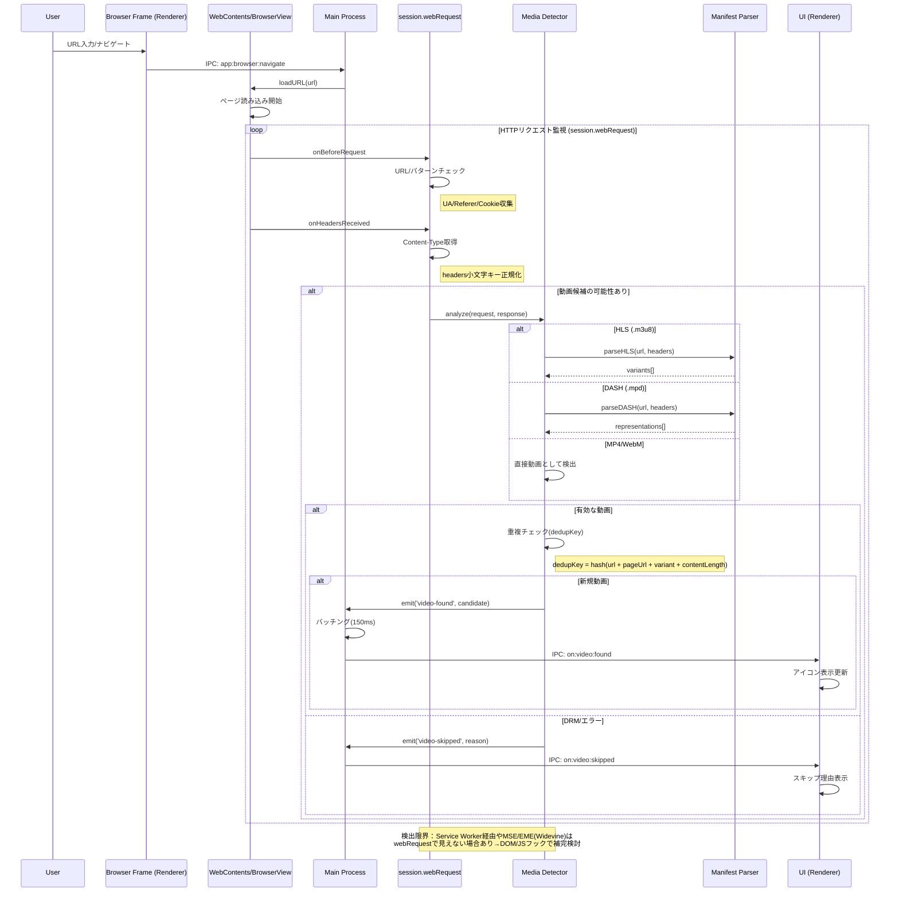
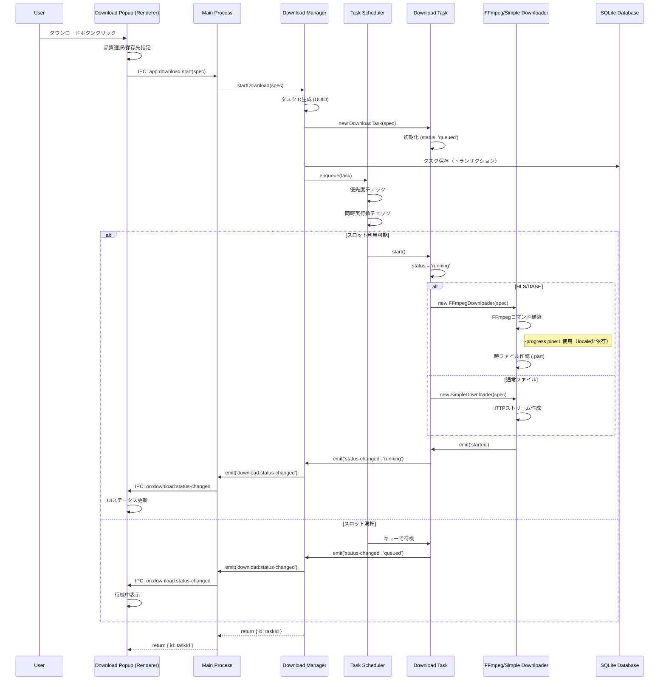
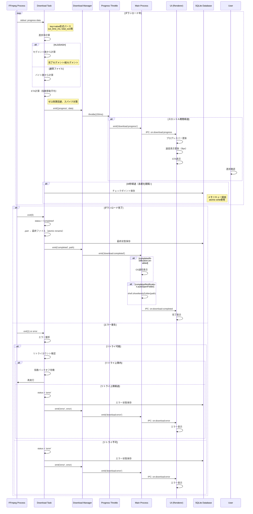
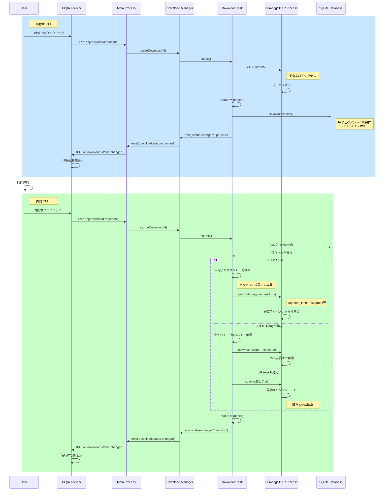
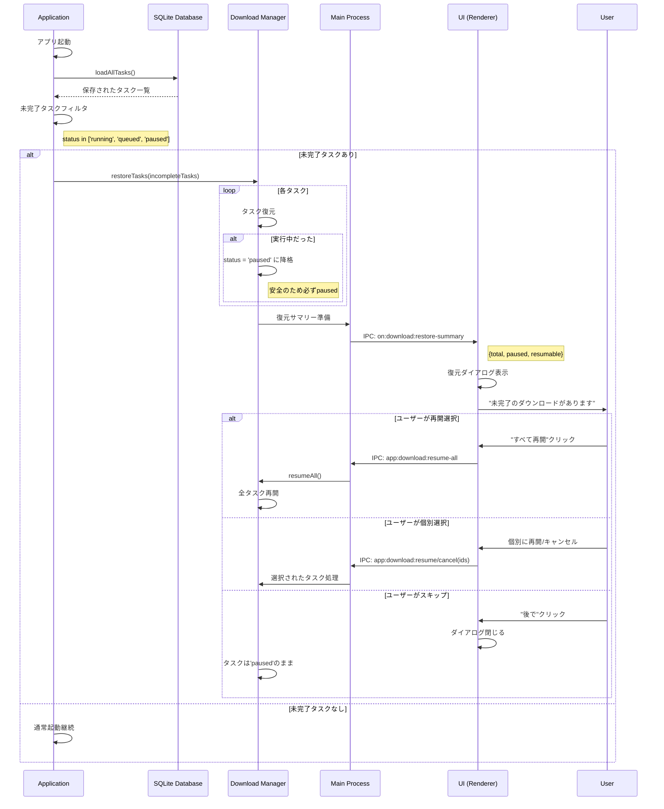
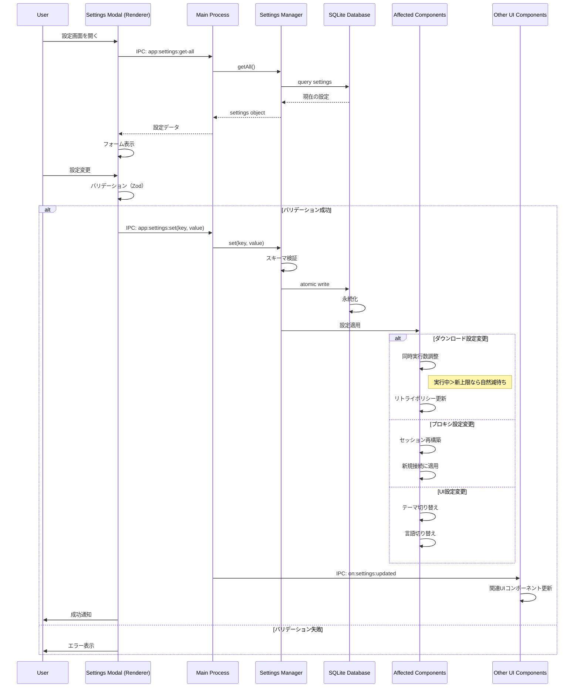
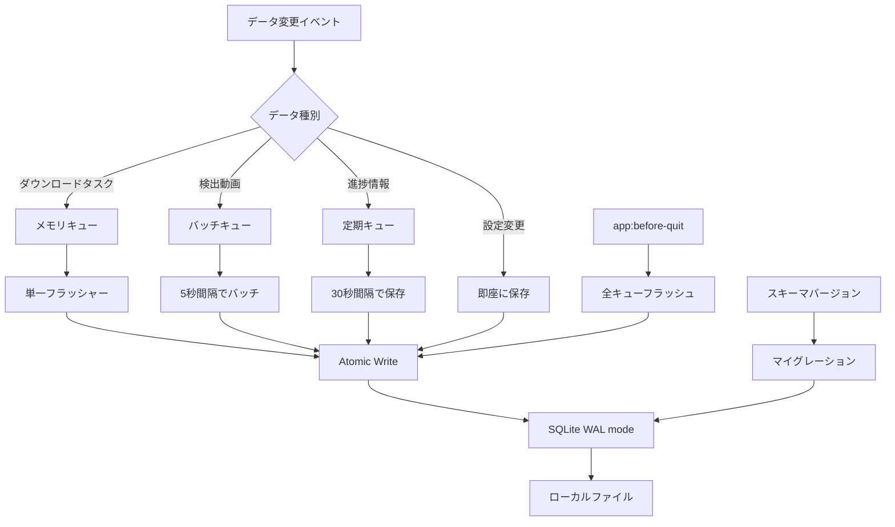
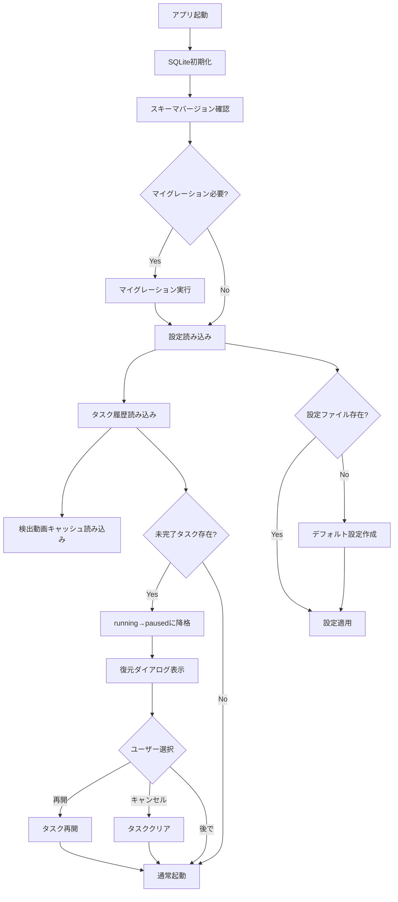
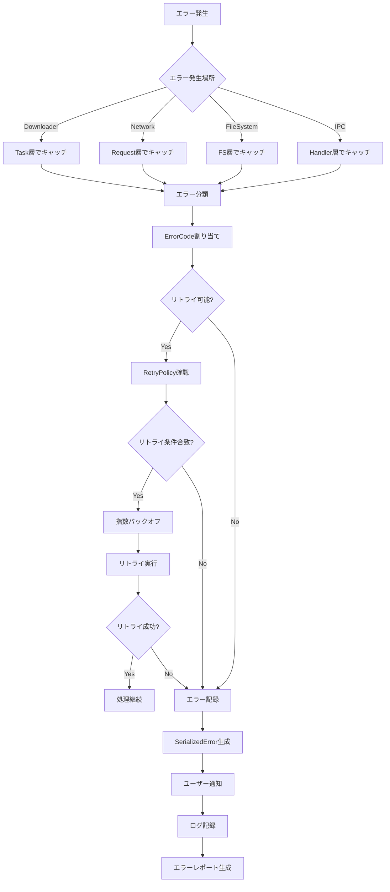
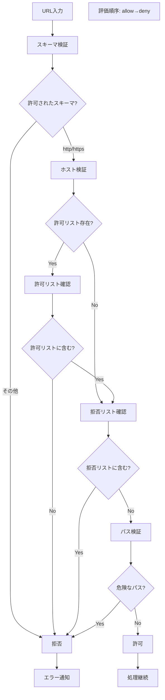

# Video Downloader データフロー設計（改訂版）

## 1. 概要

本ドキュメントでは、Video Downloaderアプリケーション内のデータフローを定義します。
IPCチャンネル名は最新仕様（v1.1）に準拠し、実装時の注意点を明記しています。

## 2. 主要データフロー

### 2.1 動画検出フロー



### 2.2 ダウンロード開始フロー



### 2.3 ダウンロード進捗フロー



### 2.4 一時停止/再開フロー



### 2.5 アプリケーション起動時の復元フロー



### 2.6 設定変更フロー



## 3. データ永続化フロー

### 3.1 データ保存タイミング



### 3.2 データ読み込みフロー



## 4. エラーハンドリングフロー

### 4.1 エラー伝播



## 5. パフォーマンス最適化フロー

### 5.1 メモリ管理

```mermaid
graph TD
    A[大容量ファイルダウンロード] --> B[ストリーミング処理]
    B --> C[チャンクサイズ: 64KB]
    
    C --> D[バッファ管理]
    D --> E{メモリ使用量}
    
    E -->|80%以上| F[バックプレッシャー適用]
    E -->|80%未満| G[通常処理継続]
    
    F --> H[stream.pause()]
    H --> I[バッファフラッシュ]
    I --> J[メモリ解放待機]
    J --> K[stream.resume()]
    K --> G
    
    G --> L[ディスク書き込み]
    L --> M[バッファクリア]
    
    note1[手動GCは不可]
    note2[パイプライン制御で対応]
```

## 6. セキュリティフロー

### 6.1 URL検証



### 6.2 ファイルパス検証

```mermaid
graph TD
    A[保存パス指定] --> B[絶対パス変換]
    B --> C[正規化]
    C --> D[予約文字サニタイズ]
    
    D --> E[Windows予約文字除去]
    note right of E: < > : " / \ | ? * 除去
    E --> F[予約名回避]
    note right of F: CON, AUX, NUL, COM1-9, LPT1-9
    
    F --> G[先頭末尾処理]
    note right of G: 空白・ドット除去
    
    G --> H{ダウンロードディレクトリ内?}
    H -->|Yes| I[長さ確認]
    H -->|No| J[拒否]
    
    I --> K{パス長制限内?}
    K -->|Yes| L[許可]
    K -->|No| M[短縮]
    
    M --> L
    J --> N[エラー通知]
```

## 7. 実装上の注意事項

### 7.1 FFmpeg進捗パース
- `-progress pipe:1` 使用（locale非依存）
- key=value形式で安定した値を取得
- `out_time_ms`, `total_size` 等のキーを使用

### 7.2 ETA計算
- ゼロ除算回避
- 速度スパイク対策で指数移動平均（EMA）使用
- 異常値の除外処理

### 7.3 一時停止と再開
- 常に `.part` ファイルを使用
- 完了時にatomic renameで最終ファイルに
- 破損コンテナ対策でハッシュ検証（オプション）

### 7.4 復元処理
- 起動時は必ず `running` → `paused` に降格
- ユーザー選択で明示的に再開

### 7.5 同時実行制御
- `MAX_CONCURRENT` 変更時の動作：
  - 実行中タスク数 > 新上限なら自然減を待つ
  - 強制停止はしない

### 7.6 dedupKey仕様
```
dedupKey = SHA256(
  url + 
  pageUrl + 
  variantKey +  // bandwidth + resolution
  contentLength // optional
)
```

## 8. IPC追加仕様

### 8.1 復元サマリーイベント

```typescript
// on:download:restore-summary
interface RestoreSummaryEvent {
  total: number;      // 未完了タスク総数
  paused: number;     // 一時停止中の数
  resumable: number;  // 再開可能な数
  failed: number;     // エラー状態の数
}
```

### 8.2 一括操作API

```typescript
// app:download:resume-all
// app:download:pause-all
// app:download:cancel-all
```

これらは既存の個別操作APIの拡張として実装。