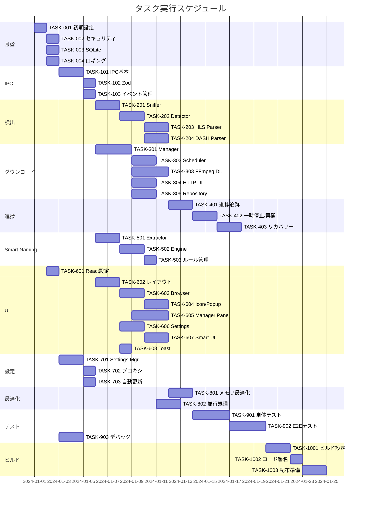

# Video Downloader 実装タスク

## 概要

全タスク数: 45
推定作業時間: 120時間
クリティカルパス: TASK-001 → TASK-002 → TASK-003 → TASK-101 → TASK-201 → TASK-301

## タスク一覧

### フェーズ1: 基盤構築

#### TASK-001: プロジェクト初期設定

- [ ] **タスク完了**
- **タスクタイプ**: DIRECT
- **依存タスク**: なし
- **実装詳細**:
  - Electronプロジェクトの初期化
  - TypeScript設定
  - Vite設定（Renderer用）
  - ESLint/Prettier設定
  - package.json設定
- **完了条件**:
  - [ ] `npm start` でElectronアプリが起動
  - [ ] TypeScriptコンパイルが成功
  - [ ] Lintが正常動作

#### TASK-002: セキュリティ基盤設定

- [ ] **タスク完了**
- **タスクタイプ**: DIRECT
- **依存タスク**: TASK-001
- **実装詳細**:
  - BrowserWindow セキュリティ設定
  - CSP (Content Security Policy) 設定
  - Preload Script の基本実装
  - contextBridge設定
  - 法的同意画面の実装
- **完了条件**:
  - [ ] セキュアなWindow設定が適用
  - [ ] 初回起動時に同意画面表示
  - [ ] IPCが安全に動作

#### TASK-003: SQLiteデータベース設定

- [ ] **タスク完了**
- **タスクタイプ**: DIRECT
- **依存タスク**: TASK-001
- **実装詳細**:
  - better-sqlite3 インストール
  - データベース初期化処理
  - マイグレーションシステム
  - スキーマ作成（database-schema.sql）
- **完了条件**:
  - [ ] データベースファイル作成
  - [ ] 全テーブル作成成功
  - [ ] 基本CRUD操作確認

#### TASK-004: ロギングシステム実装

- [ ] **タスク完了**
- **タスクタイプ**: TDD
- **依存タスク**: TASK-001
- **実装詳細**:
  - winston設定
  - ログローテーション設定
  - セキュアロギング（PII除去）
  - ログレベル管理
- **テスト要件**:
  - [ ] ログ出力テスト
  - [ ] PII除去テスト
  - [ ] ローテーションテスト

### フェーズ2: IPC通信基盤

#### TASK-101: IPC基本実装

- [ ] **タスク完了**
- **タスクタイプ**: TDD
- **依存タスク**: TASK-002
- **実装詳細**:
  - IPCハンドラー基底クラス
  - Preload Script IPC Bridge
  - 型安全なIPC定義
  - エラーハンドリング
- **テスト要件**:
  - [ ] Main-Renderer通信テスト
  - [ ] エラー伝播テスト
  - [ ] 型チェックテスト

#### TASK-102: Zodスキーマ実装

- [ ] **タスク完了**
- **タスクタイプ**: TDD
- **依存タスク**: TASK-101
- **実装詳細**:
  - Zodインストール
  - IPCメッセージスキーマ定義
  - バリデーション実装
  - エラーレスポンス処理
- **テスト要件**:
  - [ ] スキーマ検証テスト
  - [ ] 不正データ拒否テスト
  - [ ] エラーメッセージテスト

#### TASK-103: イベント管理システム

- [ ] **タスク完了**
- **タスクタイプ**: TDD
- **依存タスク**: TASK-101
- **実装詳細**:
  - EventEmitter拡張
  - イベントサブスクリプション管理
  - イベントスロットリング
  - メモリリーク対策
- **テスト要件**:
  - [ ] イベント発火テスト
  - [ ] サブスクリプションテスト
  - [ ] メモリリークテスト

### フェーズ3: 動画検出機能

#### TASK-201: Request Sniffer実装

- [ ] **タスク完了**
- **タスクタイプ**: TDD
- **依存タスク**: TASK-102
- **実装詳細**:
  - webRequest API実装
  - HTTPヘッダー収集
  - Content-Type判定
  - URLパターンマッチング
- **テスト要件**:
  - [ ] リクエスト検出テスト
  - [ ] ヘッダー収集テスト
  - [ ] パターンマッチテスト

#### TASK-202: Media Detector実装

- [ ] **タスク完了**
- **タスクタイプ**: TDD
- **依存タスク**: TASK-201
- **実装詳細**:
  - HLS/DASH/MP4判定ロジック
  - DRM検出（ブロック用）
  - 重複検出（dedupKey）
  - Chrome DevTools Protocol統合
- **テスト要件**:
  - [ ] メディアタイプ判定テスト
  - [ ] DRM検出テスト
  - [ ] 重複除去テスト

#### TASK-203: HLS Manifest Parser

- [ ] **タスク完了**
- **タスクタイプ**: TDD
- **依存タスク**: TASK-202
- **実装詳細**:
  - m3u8パース処理
  - マスター/メディアプレイリスト判定
  - バリアント抽出
  - セグメント情報取得
  - ライブストリーム検出
- **テスト要件**:
  - [ ] m3u8パーステスト
  - [ ] バリアント抽出テスト
  - [ ] ライブ判定テスト

#### TASK-204: DASH Manifest Parser

- [ ] **タスク完了**
- **タスクタイプ**: TDD
- **依存タスク**: TASK-202
- **実装詳細**:
  - MPDファイルパース
  - Representation抽出
  - BaseURL処理
  - Period/AdaptationSet解析
- **テスト要件**:
  - [ ] MPDパーステスト
  - [ ] Representation抽出テスト
  - [ ] BaseURL解決テスト

### フェーズ4: ダウンロードエンジン

#### TASK-301: Download Manager実装

- [ ] **タスク完了**
- **タスクタイプ**: TDD
- **依存タスク**: TASK-103, TASK-003
- **実装詳細**:
  - タスク管理システム
  - 状態遷移管理（State Machine）
  - 優先度管理
  - データベース永続化
- **テスト要件**:
  - [ ] タスク作成テスト
  - [ ] 状態遷移テスト
  - [ ] 永続化テスト

#### TASK-302: Task Scheduler実装

- [ ] **タスク完了**
- **タスクタイプ**: TDD
- **依存タスク**: TASK-301
- **実装詳細**:
  - 同時実行数制御
  - 優先度キュー
  - サイト別制限
  - 帯域制御
- **テスト要件**:
  - [ ] 同時実行制御テスト
  - [ ] 優先度処理テスト
  - [ ] 帯域制限テスト

#### TASK-303: FFmpeg Downloader実装

- [ ] **タスク完了**
- **タスクタイプ**: TDD
- **依存タスク**: TASK-301
- **実装詳細**:
  - FFmpegプロセス管理
  - HLS/DASHダウンロード
  - 進捗解析（stderr）
  - セグメント管理
  - エラーハンドリング
- **テスト要件**:
  - [ ] プロセス起動テスト
  - [ ] 進捗解析テスト
  - [ ] エラー処理テスト

#### TASK-304: Simple HTTP Downloader実装

- [ ] **タスク完了**
- **タスクタイプ**: TDD
- **依存タスク**: TASK-301
- **実装詳細**:
  - HTTPストリーミング
  - Range要求サポート
  - 再開機能
  - チャンクダウンロード
- **テスト要件**:
  - [ ] ダウンロードテスト
  - [ ] Range要求テスト
  - [ ] 再開機能テスト

#### TASK-305: Download Repository実装

- [ ] **タスク完了**
- **タスクタイプ**: TDD
- **依存タスク**: TASK-003, TASK-301
- **実装詳細**:
  - タスク永続化
  - セグメント状態管理
  - チェックポイント保存
  - クラッシュリカバリー
- **テスト要件**:
  - [ ] CRUD操作テスト
  - [ ] トランザクションテスト
  - [ ] リカバリーテスト

### フェーズ5: 進捗・再開機能

#### TASK-401: 進捗追跡システム

- [ ] **タスク完了**
- **タスクタイプ**: TDD
- **依存タスク**: TASK-303, TASK-304
- **実装詳細**:
  - 進捗計算ロジック
  - ETA計算
  - 速度計算
  - スロットリング（150ms）
- **テスト要件**:
  - [ ] 進捗計算テスト
  - [ ] ETA精度テスト
  - [ ] スロットリングテスト

#### TASK-402: 一時停止/再開機能

- [ ] **タスク完了**
- **タスクタイプ**: TDD
- **依存タスク**: TASK-305, TASK-401
- **実装詳細**:
  - プロセス一時停止
  - チェックポイント保存
  - セグメント再開
  - Range再開
- **テスト要件**:
  - [ ] 一時停止テスト
  - [ ] 再開テスト
  - [ ] データ整合性テスト

#### TASK-403: クラッシュリカバリー

- [ ] **タスク完了**
- **タスクタイプ**: TDD
- **依存タスク**: TASK-402
- **実装詳細**:
  - 起動時タスクスキャン
  - 状態検証
  - 自動再開オプション
  - 破損ファイル検出
- **テスト要件**:
  - [ ] リカバリーテスト
  - [ ] 状態復元テスト
  - [ ] 破損検出テスト

### フェーズ6: Smart Naming機能

#### TASK-501: Token Extractor実装

- [ ] **タスク完了**
- **タスクタイプ**: TDD
- **依存タスク**: TASK-102
- **実装詳細**:
  - DOM情報抽出（Preload）
  - メタタグ解析
  - 構造化データ解析
  - カスタムルール処理
- **テスト要件**:
  - [ ] DOM抽出テスト
  - [ ] メタタグ解析テスト
  - [ ] JSON-LD解析テスト

#### TASK-502: Smart Naming Engine実装

- [ ] **タスク完了**
- **タスクタイプ**: TDD
- **依存タスク**: TASK-501
- **実装詳細**:
  - テンプレート処理
  - トークン置換
  - ファイル名サニタイズ
  - 重複回避
- **テスト要件**:
  - [ ] テンプレート処理テスト
  - [ ] サニタイゼーションテスト
  - [ ] 重複回避テスト

#### TASK-503: サイト別ルール管理

- [ ] **タスク完了**
- **タスクタイプ**: TDD
- **依存タスク**: TASK-502, TASK-003
- **実装詳細**:
  - ルールデータベース
  - プリセット管理
  - カスタムルール保存
  - エクスポート/インポート
- **テスト要件**:
  - [ ] ルール適用テスト
  - [ ] 優先度テスト
  - [ ] エクスポート/インポートテスト

### フェーズ7: UI実装（React）

#### TASK-601: React基本設定

- [ ] **タスク完了**
- **タスクタイプ**: DIRECT
- **依存タスク**: TASK-001
- **実装詳細**:
  - React + TypeScript設定
  - Tailwind CSS設定
  - Zustand設定
  - React Query設定
- **完了条件**:
  - [ ] React開発サーバー起動
  - [ ] Hot Reload動作
  - [ ] スタイル適用確認

#### TASK-602: メインレイアウト実装

- [ ] **タスク完了**
- **タスクタイプ**: TDD
- **依存タスク**: TASK-601, TASK-102
- **実装詳細**:
  - App.tsx実装
  - レイアウトコンポーネント
  - ルーティング設定
  - テーマ管理
- **UI/UX要件**:
  - [ ] レスポンシブデザイン
  - [ ] ダークモード対応
  - [ ] アクセシビリティ対応

#### TASK-603: Browser Frame実装

- [ ] **タスク完了**
- **タスクタイプ**: TDD
- **依存タスク**: TASK-602
- **実装詳細**:
  - WebViewコンポーネント
  - ナビゲーションバー
  - URL入力
  - 戻る/進む/リロード
- **UI/UX要件**:
  - [ ] URL自動補完
  - [ ] ロード状態表示
  - [ ] エラー表示

#### TASK-604: Download Icon & Popup実装

- [ ] **タスク完了**
- **タスクタイプ**: TDD
- **依存タスク**: TASK-602, TASK-202
- **実装詳細**:
  - ダウンロードアイコン
  - 検出動画ポップアップ
  - 品質選択UI
  - ダウンロード開始ボタン
- **UI/UX要件**:
  - [ ] アニメーション効果
  - [ ] バッジ表示（検出数）
  - [ ] ツールチップ

#### TASK-605: Download Manager Panel実装

- [ ] **タスク完了**
- **タスクタイプ**: TDD
- **依存タスク**: TASK-602, TASK-301
- **実装詳細**:
  - ダウンロード一覧
  - 進捗表示
  - コントロールボタン
  - フィルター/ソート
- **UI/UX要件**:
  - [ ] プログレスバー
  - [ ] 速度/ETA表示
  - [ ] ドラッグ&ドロップ（優先度）
  - [ ] 仮想スクロール

#### TASK-606: Settings Modal実装

- [ ] **タスク完了**
- **タスクタイプ**: TDD
- **依存タスク**: TASK-602
- **実装詳細**:
  - 設定画面
  - タブ切り替え
  - フォームバリデーション
  - 保存/キャンセル
- **UI/UX要件**:
  - [ ] 即時反映プレビュー
  - [ ] エラー表示
  - [ ] 確認ダイアログ

#### TASK-607: Smart Naming UI実装

- [ ] **タスク完了**
- **タスクタイプ**: TDD
- **依存タスク**: TASK-606, TASK-502
- **実装詳細**:
  - テンプレート編集
  - トークンパレット
  - リアルタイムプレビュー
  - カスタムルール編集
- **UI/UX要件**:
  - [ ] インラインヘルプ
  - [ ] プレビュー更新
  - [ ] ドラッグ&ドロップ

#### TASK-608: Toast通知システム実装

- [ ] **タスク完了**
- **タスクタイプ**: TDD
- **依存タスク**: TASK-602
- **実装詳細**:
  - Toast コンポーネント
  - 通知キュー管理
  - アニメーション
  - 自動非表示
- **UI/UX要件**:
  - [ ] スライドアニメーション
  - [ ] 複数通知のスタック
  - [ ] 手動削除

### フェーズ8: 設定管理

#### TASK-701: Settings Manager実装

- [ ] **タスク完了**
- **タスクタイプ**: TDD
- **依存タスク**: TASK-003
- **実装詳細**:
  - 設定の読み書き
  - デフォルト値管理
  - バリデーション
  - マイグレーション
- **テスト要件**:
  - [ ] 設定保存テスト
  - [ ] デフォルト値テスト
  - [ ] マイグレーションテスト

#### TASK-702: プロキシ設定実装

- [ ] **タスク完了**
- **タスクタイプ**: TDD
- **依存タスク**: TASK-701
- **実装詳細**:
  - プロキシ設定UI
  - セッション設定
  - 認証情報管理（keytar）
  - バイパスリスト
- **テスト要件**:
  - [ ] プロキシ接続テスト
  - [ ] 認証テスト
  - [ ] バイパステスト

#### TASK-703: 自動更新設定

- [ ] **タスク完了**
- **タスクタイプ**: DIRECT
- **依存タスク**: TASK-701
- **実装詳細**:
  - electron-updater設定
  - 更新チェック
  - ダウンロード進捗
  - インストール処理
- **完了条件**:
  - [ ] 更新チェック動作
  - [ ] 署名検証成功
  - [ ] 更新インストール確認

### フェーズ9: パフォーマンス最適化

#### TASK-801: メモリ管理最適化

- [ ] **タスク完了**
- **タスクタイプ**: TDD
- **依存タスク**: TASK-303, TASK-304
- **実装詳細**:
  - ストリーミング処理
  - バッファ管理
  - ガベージコレクション
  - メモリリーク対策
- **テスト要件**:
  - [ ] メモリ使用量テスト
  - [ ] リークテスト
  - [ ] パフォーマンステスト

#### TASK-802: 並行処理最適化

- [ ] **タスク完了**
- **タスクタイプ**: TDD
- **依存タスク**: TASK-302
- **実装詳細**:
  - Worker Threads活用
  - 非同期処理最適化
  - バックプレッシャー制御
  - CPUバランシング
- **テスト要件**:
  - [ ] 並行処理テスト
  - [ ] 負荷テスト
  - [ ] スケーラビリティテスト

### フェーズ10: テストとデバッグ

#### TASK-901: 単体テストスイート

- [ ] **タスク完了**
- **タスクタイプ**: DIRECT
- **依存タスク**: 全機能実装タスク
- **実装詳細**:
  - Jest設定
  - 単体テスト作成
  - カバレッジ設定
  - CI統合
- **完了条件**:
  - [ ] カバレッジ80%以上
  - [ ] 全テスト成功
  - [ ] CI自動実行

#### TASK-902: E2Eテストスイート

- [ ] **タスク完了**
- **タスクタイプ**: DIRECT
- **依存タスク**: TASK-901
- **実装詳細**:
  - Playwright設定
  - E2Eシナリオ作成
  - テストデータ準備
  - CI統合
- **完了条件**:
  - [ ] 主要フロー網羅
  - [ ] クロスプラットフォーム
  - [ ] 自動実行設定

#### TASK-903: デバッグツール実装

- [ ] **タスク完了**
- **タスクタイプ**: TDD
- **依存タスク**: TASK-004
- **実装詳細**:
  - DevToolsExtension
  - ログビューアー
  - パフォーマンスモニター
  - ネットワークインスペクター
- **テスト要件**:
  - [ ] ツール起動テスト
  - [ ] データ収集テスト
  - [ ] 表示テスト

### フェーズ11: ビルドと配布

#### TASK-1001: ビルド設定

- [ ] **タスク完了**
- **タスクタイプ**: DIRECT
- **依存タスク**: TASK-901, TASK-902
- **実装詳細**:
  - electron-builder設定
  - マルチプラットフォーム設定
  - アイコン/リソース準備
  - ビルドスクリプト
- **完了条件**:
  - [ ] Windows/Mac/Linux ビルド成功
  - [ ] インストーラー生成
  - [ ] サイズ最適化

#### TASK-1002: コード署名設定

- [ ] **タスク完了**
- **タスクタイプ**: DIRECT
- **依存タスク**: TASK-1001
- **実装詳細**:
  - Windows コードサイニング
  - macOS notarization
  - 証明書管理
  - CI/CD統合
- **完了条件**:
  - [ ] 署名成功
  - [ ] Notarization成功
  - [ ] 自動化設定

#### TASK-1003: 配布準備

- [ ] **タスク完了**
- **タスクタイプ**: DIRECT
- **依存タスク**: TASK-1002, TASK-703
- **実装詳細**:
  - GitHub Releases設定
  - 自動更新サーバー
  - ダウンロードページ
  - ドキュメント整備
- **完了条件**:
  - [ ] リリースパイプライン
  - [ ] 更新配信確認
  - [ ] ドキュメント完成

## 実行順序

## 優先実装順序（推奨）

1. **基盤構築**: TASK-001〜004（必須基盤）
2. **IPC通信**: TASK-101〜103（通信基盤）
3. **動画検出**: TASK-201〜204（コア機能1）
4. **ダウンロード**: TASK-301〜305（コア機能2）
5. **UI基本**: TASK-601〜605（ユーザビリティ）
6. **進捗管理**: TASK-401〜403（UX向上）
7. **Smart Naming**: TASK-501〜503, 607（付加価値）
8. **設定管理**: TASK-606, 701〜703（カスタマイズ）
9. **最適化**: TASK-801〜802（品質向上）
10. **テスト**: TASK-901〜903（品質保証）
11. **ビルド**: TASK-1001〜1003（リリース）

## 成功指標

- [ ] 全単体テスト成功（カバレッジ80%以上）
- [ ] E2Eテスト主要シナリオ成功
- [ ] メモリリークなし
- [ ] 3プラットフォーム動作確認
- [ ] 自動更新動作確認
- [ ] DRM検出・ブロック動作確認
- [ ] セキュリティチェック完了